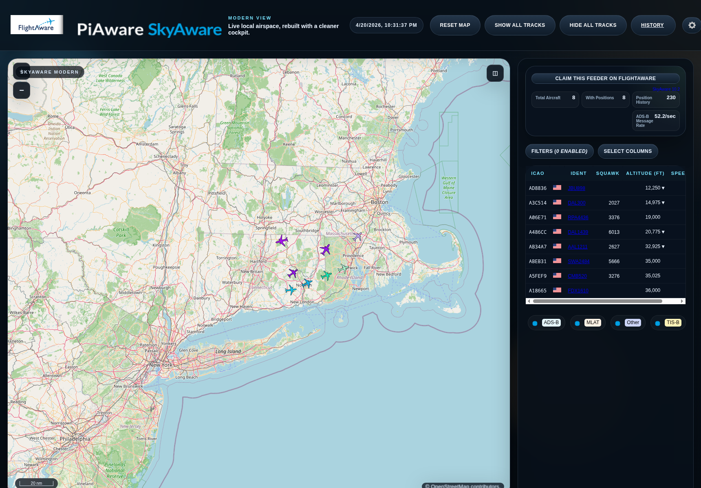
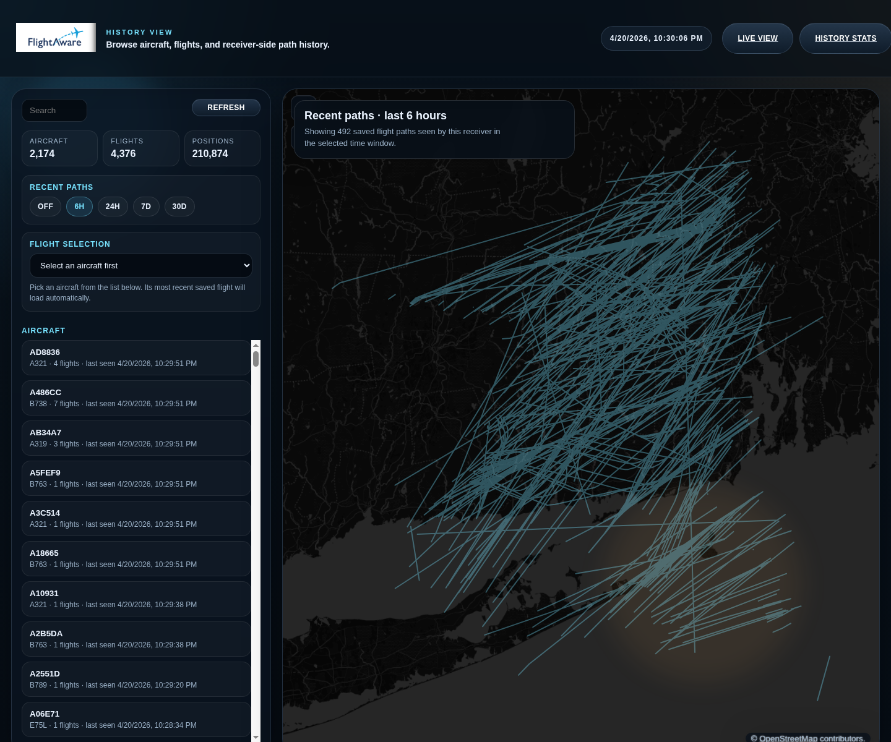
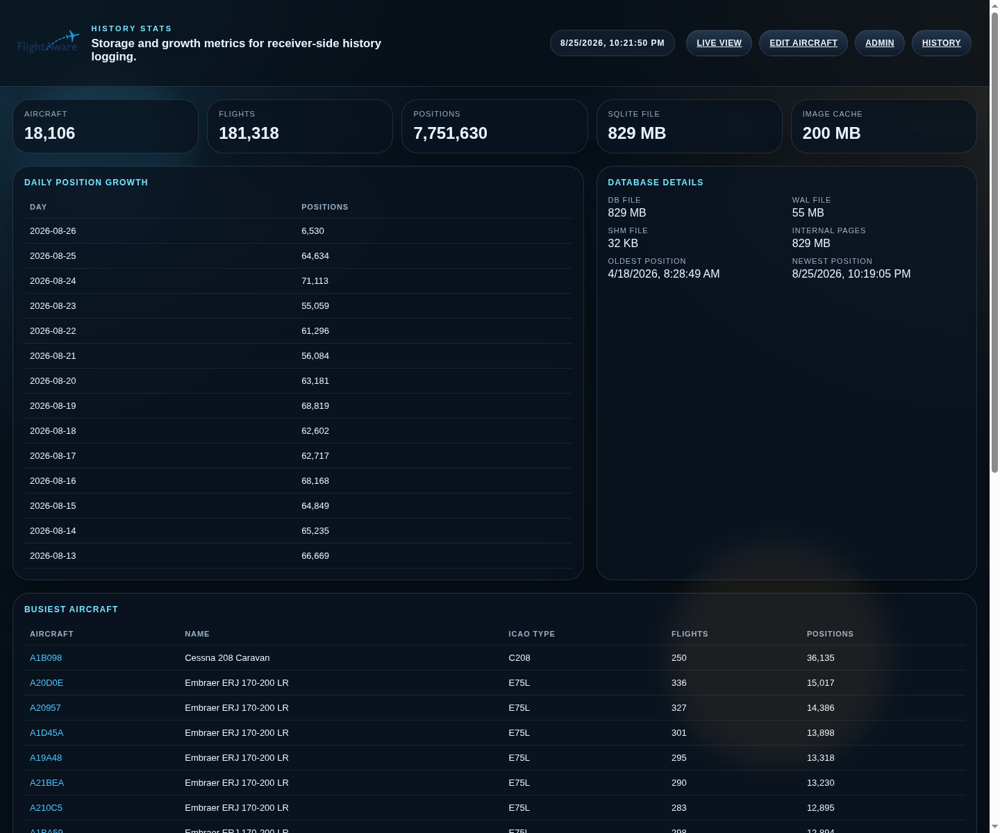

# PiAware Modern

This project is a drop-in replacement web UI for an existing PiAware / SkyAware
installation.

It keeps the original SkyAware live-view runtime pieces that PiAware already
ships, but replaces the top-level pages, styling, history tooling, and aircraft
thumbnail flow with the modernized version in this repository.

## What it includes

- Modernized live view at `index.html`
- Flight history page at `history.html`
- History stats page at `history-stats.html`
- Local history logger and aircraft image cache services in `services/`

## Screenshots

### Live view



### History view



### History stats



## Historical view

The history side is what turns this from a prettier live map into something
much more useful.

It keeps a local record of aircraft seen by your receiver, stores flight-path
points over time, and lets you go back and inspect what actually passed
through your airspace. You can browse aircraft you have seen before, review
saved flights, draw historic paths on the map, and look at recent traffic
windows like the last 6 hours, 24 hours, 7 days, or 30 days.

That means you are not limited to "what is overhead right now." You can use it
to answer questions like:

- What flew over last night?
- Which aircraft have I seen before?
- What path did that flight actually take as received by my station?
- How busy was my receiver today, this week, or this month?

## Install

These instructions assume you already have a working PiAware installation and
want to replace the contents of its SkyAware HTML directory.

1. Copy this project into the PiAware SkyAware HTML directory.

   Typical target:

   ```bash
   /usr/share/skyaware/html
   ```

   Example:

   ```bash
   sudo rsync -a --delete /path/to/piaware-modern/ /usr/share/skyaware/html/
   ```

2. Install and start the supporting services.

   ```bash
   sudo bash /usr/share/skyaware/html/services/install-services.sh
   ```

## What the install script does

The service installer:

- writes systemd unit files for the history logger and aircraft image cache
- points those units at the actual install path you copied into
- reloads systemd
- enables and starts both services

## Runtime notes

- The history database is created automatically under `data/` if it does not
  already exist.
- Aircraft images are cached automatically under `assets/aircraft/types/` as
  aircraft types are resolved.
- Those runtime cache files are intentionally not tracked in git.
- Service logs are written under `logs/`:
  - `logs/flight-history.log`
  - `logs/aircraft-image-cache.log`
- Logs rotate daily and keep the previous 7 rotated log files.

## Aircraft Image Cache

Aircraft images are cached on demand. When the web interface requests an ICAO
aircraft type, the cache service first checks for a matching local image. If no
usable cached image exists, the service:

1. Searches Wikipedia for a likely aircraft name based on the ICAO type code.
2. Uses that name to search Wikimedia Commons for an aircraft photo.
3. Scores the results and rejects unsupported files, document thumbnails, and
   results whose titles indicate that they are not aircraft photos.
4. Downloads the selected image and records its name, caption, source, and
   Wikimedia file title.

Cached images and their `index.json` metadata file are stored under
`assets/aircraft/types/`. A later request for the same type uses the local copy
instead of repeating the online search. Cache activity and rejected searches
are recorded in `logs/aircraft-image-cache.log`.

## Edit Aircraft

Use **Edit Aircraft** from the History or History Stats menu to correct an
aircraft type's cached name, caption, source information, or image. Log in with
the admin password, then enter an ICAO aircraft type code. As you type, the page
suggests matching types already recorded in the history database.

- **Load** displays the current cache entry and image, if one exists.
- **Save Details** updates the name, caption, and source information without
  changing the cached image.
- **Search Image & Save** saves the entered details and runs the normal image
  cache search again. Images found this way pass through the cache service's
  aircraft-image checks.
- **Download URL & Save** downloads the image from the supplied direct URL and
  saves the entered details. This is a fallback when the normal search cannot
  find a suitable image; direct downloads do not use the normal search checks.

## Change Admin Password

Default password: `changeme`

Change it on first use. To reset it, delete `data/aircraft-admin-auth.json` and
restart the aircraft image cache service.

## URLs

After installation, the main pages are:

- `http://<piaware-host>/skyaware/`
- `http://<piaware-host>/skyaware/history.html`
- `http://<piaware-host>/skyaware/history-stats.html`

If you are fronting PiAware with an HTTPS reverse proxy, make sure the proxy
also exposes:

- `/history-api/`
- `/image-cache/`

## Upstream base

This project is derived in part from FlightAware's `dump1090` SkyAware web UI:

- `https://github.com/flightaware/dump1090`

See `UPSTREAM.md` and `LICENSE` for the current upstream and licensing notes.

[](https://www.codefactor.io/repository/github/compuvin/piaware-modern/overview/main)
